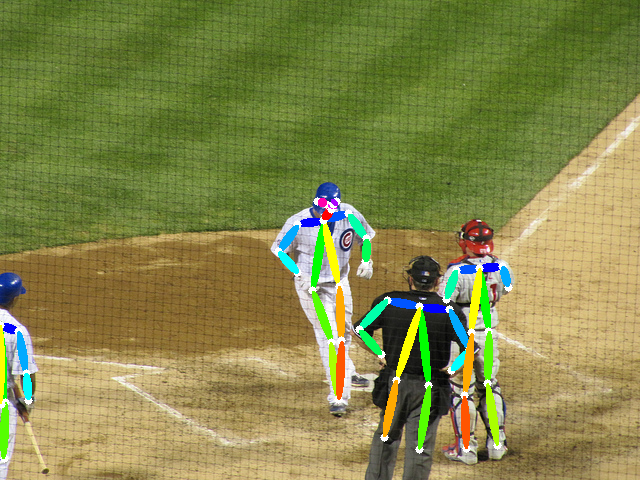
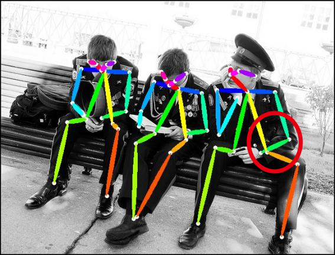
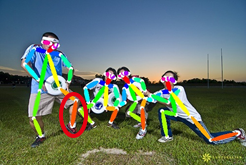

# SE-ResNet-OKHM-CMU-Pose
This is a source code of SE-ResNet-OKHM-CMU-Pose

## Introduction
Based on the architecture of https://github.com/tensorboy/pytorch_Realtime_Multi-Person_Pose_Estimation

## Results

## Require
1. [Pytorch](http://pytorch.org/)
2. [Caffe](http://caffe.berkeleyvision.org/) is required if you want convert caffe model to a pytorch model.
3. pip install pycocotools
4. pip install tensorboardX
5. pip install torch-encoding
6. git clone https://github.com/cljhwt/SE-ResNet-OKHM-CMU-Pose.git
7. Download the COCO2014 dataset

## Demo
- `cd network/caffe_to_pytorch; python convert.py` to convert a trained caffe model to pytorch model. The converted model have relative error less than 1e-6, and will be located in `./network/weight` after convert.
- Or use the model trained from scratch in [Baidu Netdisk](https://pan.baidu.com/s/1pN-dgzEqW01TFPhe00VRYg?pwd=decw ) (decw), which has better accuracy on the validataion set.
- `python demo/picture_demo.py` to run the picture demo.
- `python demo/web_demo.py` to run the web demo.

## Evalute
- `python evaluate/evaluation.py` to evaluate the model on [images seperated by the original author](https://github.com/CMU-Perceptual-Computing-Lab/caffe_rtpose/blob/master/image_info_val2014_1k.txt)

  

## Training
- `cd training; bash getData.sh` to obtain the COCO images in `dataset/COCO/images/`, keypoints annotations in `dataset/COCO/annotations/`
- Download the mask of the unlabeled person at [Dropbox](https://www.dropbox.com/s/bd9ty7b4fqd5ebf/mask.tar.gz?dl=0)
- Download the official training format at [Dropbox](https://www.dropbox.com/s/0sj2q24hipiiq5t/COCO.json?dl=0)
- `python train.py --batch_size 100 --logdir {where to store tensorboardX logs} --data_dir {path to dataset} --model_path {path to pretraind model} `
## Related repository

openpose, https://github.com/tensorboy/pytorch_Realtime_Multi-Person_Pose_Estimation
okhm, https://github.com/GengDavid/pytorch-cpn
kd, https://github.com/yuanyuanli85/Fast_Human_Pose_Estimation_Pytorch
c2f, https://www.seas.upenn.edu/~pavlakos/projects/volumetric/
https://github.com/mks0601/Integral-Human-Pose-Regression-for-3D-Human-Pose-Estimation

